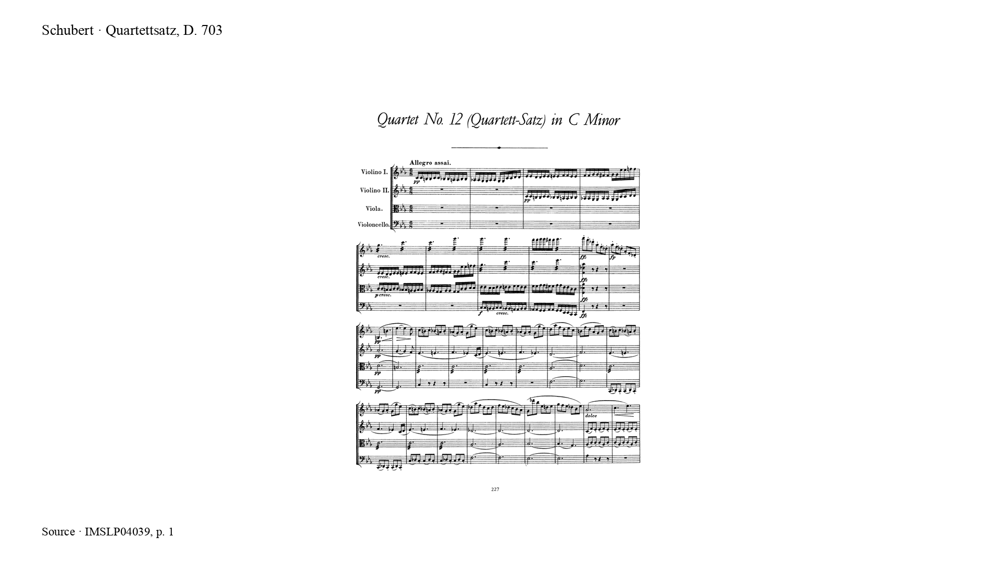

# Clara

Schubert, *Quartettsatz*, D. 703. Optical music recognition from eight scanned pages, with four-part synthesis and comparison to the OpenScore reference.

[Video](demo/clara.mp4) · [Audio](results/performance.mp3) · [MusicXML](results/prediction.musicxml) · [Scan](data/scan.pdf)



The transcription is uncorrected. Missing measures, rhythm errors and invalid ties remain. The prediction was [frozen](results/freeze.json) before the reference was downloaded; no reference notes enter the audio.

| Comparison | Pitch + onset F1 | Pitch + onset + duration F1 |
| --- | ---: | ---: |
| Staff and measure index | 47.04% | 42.57% |
| Reference-assisted measure alignment | 87.20% | 81.73% |

4,453 predicted note segments; 4,352 reference notes. The second comparison is an alignment diagnostic. Both retain all notes in their denominators.

## Reproduce

Linux x86-64; Python 3, Java compiler modules, GCC, `dpkg-deb`, Poppler, FFmpeg; 8 GB RAM. Clone with Git to retain the prediction-freeze history.

```sh
python -m pip install -r requirements.txt
python scripts/fetch.py
python scripts/prepare.py
python scripts/notation_audio.py
python scripts/video.py
python scripts/verify.py
```

[Recognition, evaluation and playback method](docs/method.md) · [Sources and licenses](PROVENANCE.md) · [Presentation sources](docs/design.md)

Original code: [MIT](LICENSE). Source data and dependencies retain their respective licenses.
